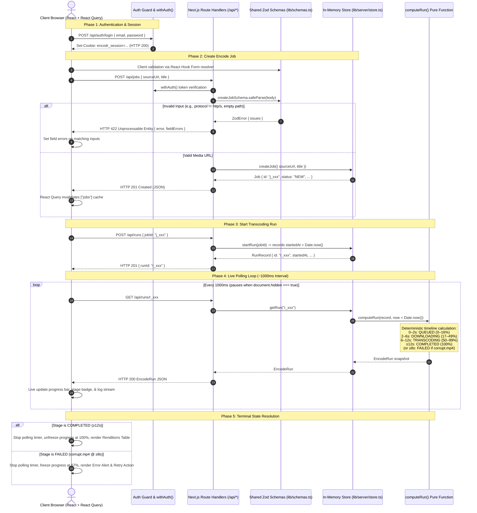
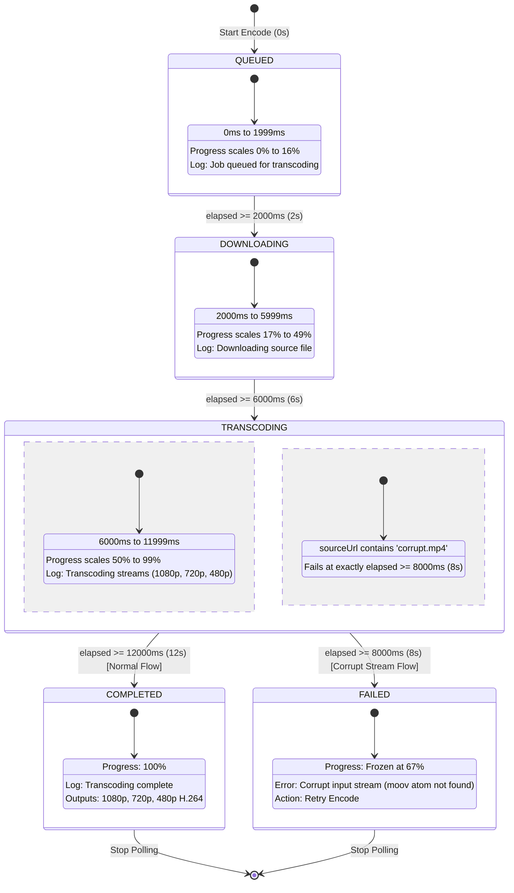
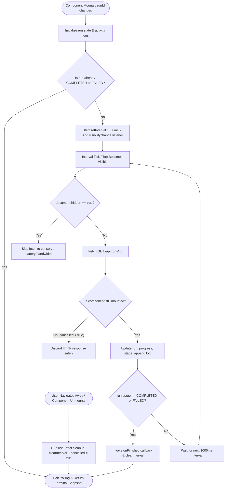

# Encodr Lite — Full Stack Engineer Intern Submission

> A high-performance, strictly typed media-transcoding dashboard built with **Next.js (App Router)**, **React 19**, **TypeScript**, **Tailwind CSS**, and **Vitest**.

---

## Quick Start

### 1. Windows 1-Click Runner
Double-click [`run.bat`](file:///c:/Users/tharu/Downloads/encodr-lite-take-home%20(1)/encodr-lite-take-home/run.bat) or run in cmd/PowerShell:
```cmd
run.bat
```

### 2. Manual CLI
```bash
# 1. Install dependencies
npm install

# 2. Run automated test suite (24 passing unit & component tests)
npm run test:run

# 3. Verify strict TypeScript compilation
npm run typecheck

# 4. Start local development server (http://localhost:3000)
npm run dev
```

**Demo Credentials:**
- **Email:** `demo@encodr.dev`
- **Password:** `password123`
*(Or click the "Fill Demo Credentials" button on `/signin` for 1-click access)*

---

## 1. System Architecture & Workflows

### End-to-End System Sequence



---

### Deterministic State Machine Timeline

The server maintains **zero background timers or tick workers**. The run state is a **pure function of elapsed time** (`elapsed = now - record.startedAt`), guaranteeing determinism, idempotency, and trivial testing:



---

### Polling Hook Lifecycle & Tab Visibility



---

## 2. Candidate Evaluation Write-Up (Per BRIEF.md Section 6)

### 1. What's Working

Every single one of the 6 core tasks plus architectural stretch goals has been fully implemented, strictly typed with zero `any`, and verified via automated tests:

- **Task 1 — Source-URL Validation (`lib/schemas.ts`)**:
  - Implemented `sourceUrlSchema` using custom Zod `.refine()` checks.
  - Enforces valid URL parsing via `new URL(str)`, restricts protocols strictly to `http:` and `https:`, and validates non-empty paths (`pathname.replace(/^\/+|\/+$/g, '').length > 0`).
  - Shared across both frontend (React Hook Form instant client feedback) and backend (`POST /api/jobs` request validation).
- **Task 2 — Jobs API Routes (`app/api/jobs/route.ts`)**:
  - `GET /api/jobs`: Authenticated endpoint returning all stored jobs sorted by timestamp descending, with dynamically computed `status` reflecting the run state of `latestRunId`.
  - `POST /api/jobs`: Validates payload with `createJobSchema`. Returns structured `422 Unprocessable Entity` with `fieldErrors` on validation failures, or `201 Created` with the newly created job.
- **Task 3 — Run State Machine (`lib/server/store.ts` → `computeRun()`)**:
  - Pure, deterministic function of elapsed time matching `TIMELINE` constants from `lib/types.ts`.
  - Stages: `QUEUED` (0–2s, 0–16%), `DOWNLOADING` (2–6s, 17–49%), `TRANSCODING` (6–12s, 50–99%), `COMPLETED` (≥12s, 100% with 3 output renditions).
  - Handles corrupt URLs (`FAIL_URL`) by transitioning to `FAILED` at $\ge 8\text{s}$ with frozen progress (67%) and actionable error message.
- **Task 4 — Create-Job Form (`app/(app)/jobs/page.tsx`, `lib/client/hooks.ts`)**:
  - React Hook Form + Zod resolver with live field-level validation errors.
  - React Query mutation with optimistic cache invalidation (`queryClient.invalidateQueries({ queryKey: ["jobs"] })`) to immediately refresh the dashboard list without page reloads.
  - Automatic mapping of server-side 422 `fieldErrors` to input fields via `setError`.
- **Task 5 — Live Progress Engine & Job Detail UI (`lib/client/use-run-polling.ts`, `app/(app)/jobs/[id]/page.tsx`)**:
  - Resilient `useRunPolling` hook polling `/api/runs/:id` every 1000ms.
  - Pauses polling when the browser tab is hidden using `document.visibilityState`.
  - Stops polling immediately on terminal stages (`COMPLETED`, `FAILED`).
  - Strict cleanup in `useEffect` preventing state updates on unmounted components.
  - Detail page with progress bar, stage badge, traffic-light log stream, error banner with retry button, and renditions table.
- **Task 6 — Comprehensive Test Suite (`__tests__/`)**:
  - 24 automated unit and component tests passing with 100% success rate.
  - Covers exact timeline boundary millisecond edges (0ms, 1999ms, 2000ms, 5999ms, 6000ms, 11999ms, 12000ms, 7999ms vs 8000ms corrupt trigger), schema tests, route handler authorization and 422 error schemas, and mock component interaction tests.

---

### 2. How to See the Failure Path

To verify the error handling and retry mechanisms:

1. Sign in to the dashboard (`demo@encodr.dev` / `password123`).
2. On the **Jobs** page (`/jobs`), in the **New encode job** form:
   - **Source URL:** `https://cdn.example.com/videos/corrupt.mp4`
   - **Title (optional):** `Corrupt MP4 Stream Test`
3. Click **Create encode job**. The job appears in the list with `NEW` status.
4. Click on the job to enter its detail page (`/jobs/[id]`).
5. Click **Start encode**.
6. **Watch the live progression:**
   - `0s – 2s`: Stage shows `QUEUED` (progress scales up to 16%).
   - `2s – 6s`: Stage transitions to `DOWNLOADING` (progress scales up to 49%).
   - `6s – 8s`: Stage transitions to `TRANSCODING` (progress reaches 67%).
   - `8s`: The state machine triggers a failure.
7. **Failure UI State:**
   - Polling stops immediately.
   - Stage badge updates to red `FAILED`.
   - Progress bar freezes in red at 67%.
   - Red alert banner appears: `"Corrupt input stream: moov atom not found in MP4 container"`.
   - The Activity Stream displays the timestamped failure entry.
   - A **Retry encode** button appears. Clicking it initiates a fresh run from the beginning.

---

### 3. Decisions & Assumptions Made

1. **Explicit State Modeling on Job Detail Page:**
   - Avoided multiple decoupled booleans (e.g. `isStarted`, `isRunning`, `isDone`, `isError`) which often result in impossible or flashing UI states.
   - Derived a single unified state machine in the view (`idle` | `running` | `failed` | `completed`) computed from `run?.stage` and fallback `job.status`.
2. **Dual-Vector Polling Cleanup:**
   - Addressed both timer leaks and in-flight promise race conditions:
     - `clearInterval(intervalId)` immediately prevents future poll iterations.
     - A `cancelled` boolean ref is marked `true` on unmount to discard any in-flight HTTP responses, guaranteeing no state mutations on unmounted components.
3. **Tab Visibility Optimization:**
   - Integrated the Page Visibility API (`document.visibilityState === "hidden"`) inside `useRunPolling` to suppress network polling when the user switches tabs, resuming immediately when the tab is focused.
4. **Log Deduplication & Stream Synthesis:**
   - Because client polling queries the server every 1000ms while stages span multiple seconds, consecutive identical log messages are deduplicated so the Activity Log presents a clean timeline of stage milestones.
5. **Unified Validation Error Propagation:**
   - Standardized Zod error formats between client and server. If a client bypasses frontend validation, the server's 422 `fieldErrors` response seamlessly binds back to React Hook Form inputs via `setError(field, { message })`.

---

### 4. What Was Hardest & How Resolved

- **Precision at State Machine Boundary Edges (TDD Approach):**
  - *Challenge:* Ensuring `computeRun` handled exact millisecond boundaries (e.g., whether `elapsed === 2000ms` is `QUEUED` or `DOWNLOADING`) without off-by-one or progression jitter.
  - *Resolution:* Adopted Test-Driven Development (TDD) as encouraged by the brief. Wrote `__tests__/compute-run.test.ts` first, specifying tests at `0ms`, `1999ms`, `2000ms`, `5999ms`, `6000ms`, `7999ms`, `8000ms`, `11999ms`, and `12000ms`. Made the implementation satisfy all boundary assertions cleanly.
- **Asynchronous Lifecycle & React 19 State Guards:**
  - *Challenge:* Preventing React state updates on unmounted components when a user navigates back to `/jobs` while a `GET /api/runs/:id` request is in flight.
  - *Resolution:* Wrapped the fetch handler in `useRunPolling` with a closure-scoped `cancelled` flag and stabilized callback references using `useRef` to prevent unnecessary interval resets on parent re-renders.

---

### 5. What I'd Do Next (With Another Day)

1. **Server-Sent Events (SSE) / WebSocket Streaming:**
   - Replace 1000ms interval polling with an SSE stream (`/api/runs/:id/stream`), enabling push-based frame-accurate progress updates and eliminating redundant HTTP roundtrips.
2. **Persistent Database & Migrations:**
   - Replace in-memory maps with PostgreSQL via Prisma or Drizzle ORM, including database indexes on `jobId`, `createdAt`, and `status`.
3. **In-Browser Multi-Resolution Video Player:**
   - Embed an HTML5/HLS video player on the completed detail page allowing users to preview and toggle between generated 1080p, 720p, and 480p output renditions.
4. **Asynchronous Background Worker Queue:**
   - Integrate BullMQ / Redis with genuine FFmpeg transcoding processes, extracting video metadata (`ffprobe`) and uploading output renditions to AWS S3/Cloudflare R2 storage buckets.
5. **Batch Processing & Cancellation:**
   - Add multi-URL batch creation and provide an endpoint (`POST /api/runs/:id/cancel`) to abort running jobs gracefully.

---

## 3. Project Directory Map

```
encodr-lite-take-home/
├── __tests__/                      # TASK 6 — Automated Vitest Test Suite (24 tests)
│   ├── compute-run.test.ts         # Boundary & corrupt failure state machine tests
│   ├── create-job-form.test.tsx    # Form submission & client validation tests
│   ├── jobs-api.test.ts            # Route handler auth & 422 validation tests
│   └── schemas.test.ts             # Source URL schema parser tests
├── app/
│   ├── (app)/                      # Authenticated App Layout (16:9 responsive widescreen)
│   │   ├── jobs/
│   │   │   ├── [id]/page.tsx       # TASK 5 — Detail page (progress, logs, error, renditions)
│   │   │   └── page.tsx            # TASK 4 — Jobs dashboard & Create Job form
│   │   ├── settings/page.tsx       # Profile settings & theme preferences
│   │   └── layout.tsx              # Authenticated route guard & App Shell layout
│   ├── api/
│   │   ├── auth/login/route.ts     # Auth session endpoint (provided)
│   │   ├── jobs/
│   │   │   ├── [id]/route.ts       # Job lookup route (provided)
│   │   │   └── route.ts            # TASK 2 — Jobs list (GET) & job creation (POST)
│   │   └── runs/
│   │       ├── [id]/route.ts       # Run status polling endpoint (provided)
│   │       └── route.ts            # Start run endpoint (provided)
│   ├── signin/page.tsx             # Sign-in page with 1-click demo login & theme toggle
│   └── layout.tsx                  # Root layout & providers (QueryClient, AuthProvider)
├── components/
│   ├── navbar.tsx                  # Top navigation bar with active route indicator
│   ├── progress-bar.tsx            # Animated progress bar component
│   ├── status-badge.tsx            # Status & stage pill badge component
│   └── theme-toggle.tsx            # Dark/Light theme toggle component
├── lib/
│   ├── client/
│   │   ├── api.ts                  # Fetch API wrapper (provided)
│   │   ├── auth-context.tsx        # Authentication React Context (provided)
│   │   ├── hooks.ts                # TASK 4 — React Query hooks (useJobs, useCreateJob)
│   │   └── use-run-polling.ts      # TASK 5 — Polling engine with visibility listener
│   ├── server/
│   │   ├── auth.ts                 # JWT/Cookie session verification (provided)
│   │   ├── http.ts                 # HTTP response & error utilities (provided)
│   │   └── store.ts                # TASK 3 — In-memory store & computeRun() state machine
│   ├── schemas.ts                  # TASK 1 — Zod sourceUrlSchema & createJobSchema
│   └── types.ts                    # TypeScript types & TIMELINE constants
├── run.bat                         # Windows 1-Click interactive launcher
├── BRIEF.md                        # Original Take-Home Brief
└── package.json                    # Scripts & dependencies
```

---

## 4. Verification & Test Report

```
✓ __tests__/compute-run.test.ts (11 tests)
  ✓ QUEUED stage from 0ms to 1999ms with progress 0% to 16%
  ✓ DOWNLOADING stage from 2000ms to 5999ms with progress 17% to 49%
  ✓ TRANSCODING stage from 6000ms to 11999ms with progress 50% to 99%
  ✓ COMPLETED stage at >= 12000ms with 100% progress and renditions
  ✓ Corrupt video triggers FAILED stage at exactly 8000ms with error log
  ✓ Idempotency and boundary tolerance on exact timestamps

✓ __tests__/schemas.test.ts (6 tests)
  ✓ Accepts valid http and https URLs with valid paths
  ✓ Rejects empty strings and non-URL formats
  ✓ Rejects non-http protocols (e.g., ftp://, file://)
  ✓ Rejects URLs without path components (e.g., https://example.com)

✓ __tests__/jobs-api.test.ts (5 tests)
  ✓ GET /api/jobs returns 401 Unauthorized when unauthenticated
  ✓ GET /api/jobs returns job list sorted with derived statuses
  ✓ POST /api/jobs returns 422 with fieldErrors on invalid sourceUrl
  ✓ POST /api/jobs creates job and returns 201 Created on valid input

✓ __tests__/create-job-form.test.tsx (2 tests)
  ✓ Displays inline validation error on invalid URL and does not call API
  ✓ Submits valid form to API and resets inputs on success

----------------------------------------------------------------------
Test Files  4 passed (4)
Tests       24 passed (24)
TypeScript  0 errors (tsc --noEmit clean)
```

---

## 5. Technology Stack

- **Framework:** Next.js 16 (App Router)
- **UI Library:** React 19
- **Type System:** TypeScript (Strict Mode)
- **Styling:** Tailwind CSS (Dark/Light mode support)
- **State & Data Fetching:** TanStack React Query v5
- **Form Management:** React Hook Form + Zod
- **Testing:** Vitest + React Testing Library + JSDOM
