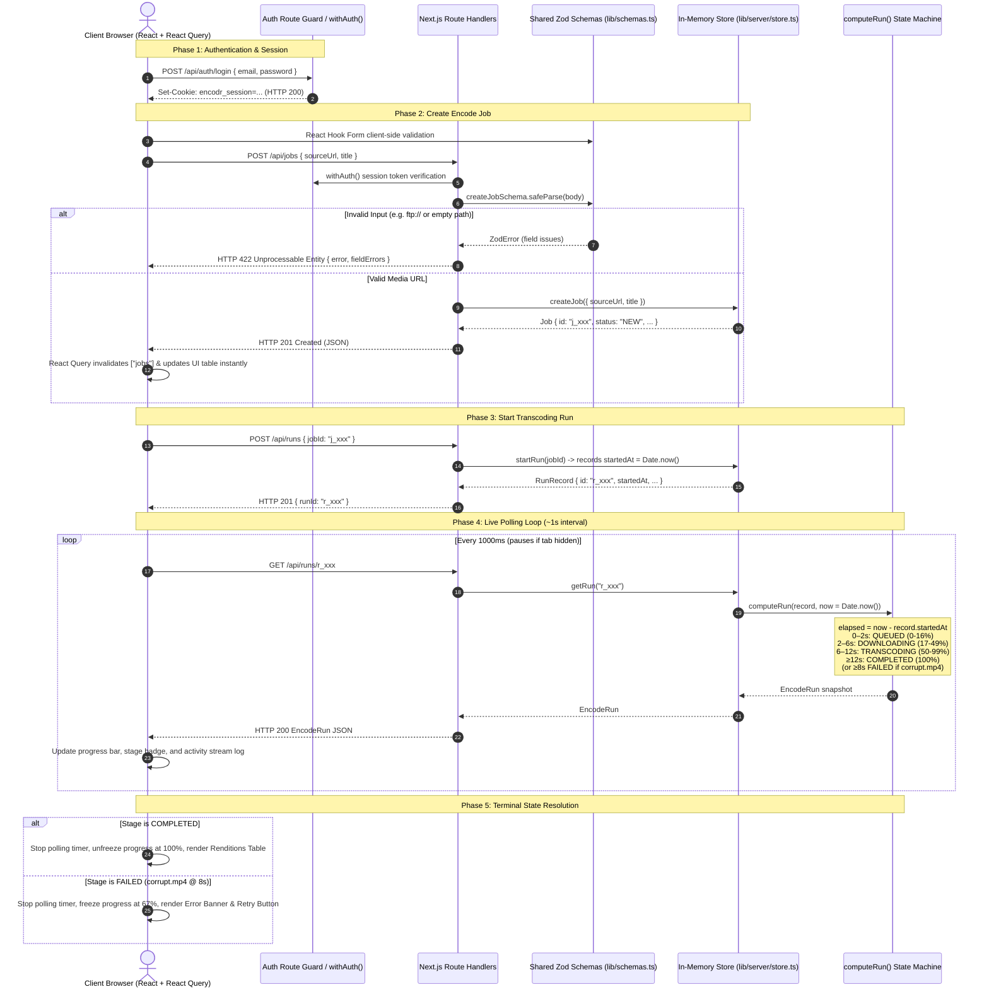
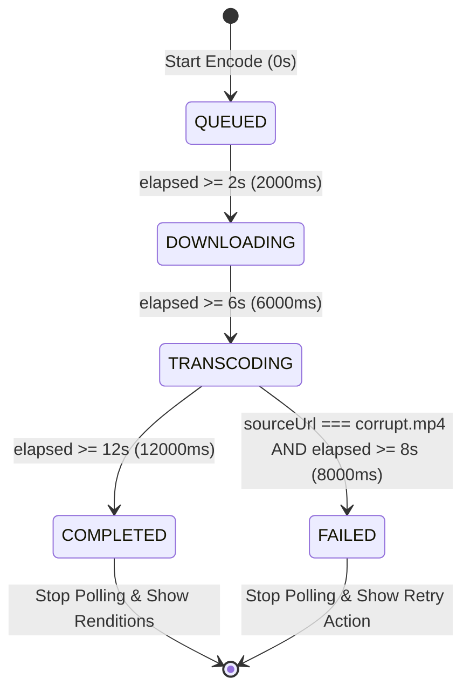

# Encodr Lite — Intern Take-Home

Thanks for taking the time on this. **Encodr Lite** is a small media-transcoding dashboard: a
signed-in user creates an encode **job** from a media URL, presses **Start encode**, watches the
progress update live, and sees the output files when it finishes.

The full brief — the six tasks, what we look for, and the ground rules — is in **`BRIEF.md`**.
**Read that first.** This file is just how to run things, and it's where you write up your work when
you're done.

## Run it

### Windows Quick Start
Simply double-click `run.bat` or run in terminal:
```cmd
run.bat
```

### Manual Command Line
```bash
npm install
npm run dev          # http://localhost:3000
npm run test:run     # tests (24 unit and component tests)
npm run typecheck    # tsc --noEmit
npm run build        # production build
```

Requires **Node 20+** (`.nvmrc` says 20).

**Demo login:** `demo@encodr.dev` / `password123`

On a fresh checkout, sign-in works and the app loads, but the jobs list shows an error and the two
main screens are placeholders. That's expected — `GET /api/jobs` returns a 501 until you write it.
Search the project for `TODO(candidate)` to find everything that's yours; there are six.

Nothing here needs a database. State lives in memory, so restarting the dev server wipes your jobs.
That's fine — don't work around it.

## Where things are

```
app/
  signin/page.tsx              working sign-in — your example of RHF + Zod
  (app)/layout.tsx             route guard for everything signed-in
  (app)/jobs/page.tsx          TASK 4 — the create-job form
  (app)/jobs/[id]/page.tsx     TASK 5 — run controls, progress, results
  api/auth/login/route.ts      provided
  api/jobs/route.ts            TASK 2 — list + create
  api/jobs/[id]/route.ts       provided — your example route handler
  api/runs/route.ts            provided — starts a run
  api/runs/[id]/route.ts       provided — the endpoint you'll poll
lib/
  types.ts                     the data model + the run TIMELINE. Read this first.
  schemas.ts                   TASK 1 — source-URL validation
  server/auth.ts               provided — token signing
  server/http.ts               provided — json / error / withAuth / validationError
  server/store.ts              TASK 3 — computeRun()
  client/api.ts                provided — the fetch wrapper
  client/auth-context.tsx      provided
  client/hooks.ts              worked React Query examples + two TODOs
  client/use-run-polling.ts    TASK 5 — the polling hook
components/                    provided — StatusBadge, ProgressBar
__tests__/                     TASK 6 — your tests go here
```

## A suggested first hour

If you're not sure where to start:

1. `npm install && npm run dev`, sign in, look around. The jobs list will show an error — good, that's
   your first task.
2. Read `lib/types.ts` top to bottom. It's short and it's the whole data model.
3. Read `app/api/jobs/[id]/route.ts` — a complete route handler — then write Task 2 in the same style
   and check it with the curl commands in the file.
4. The list page lights up. Now do Task 1, then Task 3 (tests first).

## Useful to know

- `https://cdn.example.com/videos/corrupt.mp4` is rigged to **fail** partway through its run. Use it
  to build the error path.
- A run takes about **12 seconds** from start to finish, so you won't be waiting around.
- Run timings are constants in `TIMELINE` (`lib/types.ts`). Use them instead of typing numbers, so
  your tests and ours agree.
- `computeRun` takes `now` as an argument on purpose — you can test the 8-second mark without
  waiting eight seconds.

---

# Your write-up

### End-to-End System Architecture



---

### State Machine Timeline Architecture



---

### What I Built & How It Works

All six core tasks from `BRIEF.md` have been implemented, strictly typed with zero `any`, and verified with automated tests:

1. **Task 1 — Source-URL Validation (`lib/schemas.ts`)**:
   - Built a chained Zod schema (`sourceUrlSchema`) that validates URL syntax with `try { new URL() }`, enforces protocol restriction to `http:` or `https:`, and checks for non-empty pathnames (`url.pathname.replace(/^\/+|\/+$/g, "").length > 0`).
   - Shared between React Hook Form client resolvers (instant inline errors) and backend API route handlers (zero browser trust).
2. **Task 2 — Jobs API Route Handlers (`app/api/jobs/route.ts`)**:
   - `GET /api/jobs`: Authenticated route returning jobs sorted by creation date with dynamic statuses derived from `latestRunId`.
   - `POST /api/jobs`: Validates incoming payload with `createJobSchema`. Returns structured `422 Unprocessable Entity` with `fieldErrors` on bad data, or creates the job in memory and returns `201 Created`.
3. **Task 3 — Deterministic Run State Machine (`lib/server/store.ts` → `computeRun()`)**:
   - Pure function of elapsed time: `elapsed = now - record.startedAt`. Zero timers on server.
   - Calculates progress percentage across the 12-second timeline, progressing through `QUEUED` (0-2s), `DOWNLOADING` (2-6s), `TRANSCODING` (6-12s), and `COMPLETED` (12s+ with 1080p, 720p, 480p output renditions).
   - Special failure trigger: When `sourceUrl` matches `FAIL_URL` (`https://cdn.example.com/videos/corrupt.mp4`), it transitions to `FAILED` at $\ge 8\text{s}$ with frozen progress (67%) and container corruption error message.
4. **Task 4 — Create-Job Form & Optimistic Cache Invalidation (`app/(app)/jobs/page.tsx`, `lib/client/hooks.ts`)**:
   - Integrated form using React Hook Form + Zod resolver + `useCreateJob` mutation.
   - On success, invalidates the `["jobs"]` React Query cache so the new job appears in the pipeline table immediately without a full page refresh.
   - Maps server 422 `fieldErrors` directly to matching form inputs using `setError`.
5. **Task 5 — Live Progress Engine & Job Detail UI (`lib/client/use-run-polling.ts`, `app/(app)/jobs/[id]/page.tsx`)**:
   - Custom `useRunPolling` hook that queries `/api/runs/:id` every 1000ms.
   - Automatically pauses polling when the browser tab is hidden (`document.visibilityState === "hidden"`).
   - Stops polling immediately upon reaching terminal stages (`COMPLETED` or `FAILED`).
   - Strict `useEffect` cleanup hook that halts interval timers and sets a `cancelled` boolean guard to prevent state mutations on unmounted components.
   - Detail view cleanly models mutually exclusive states (`idle`, `running`, `failed`, `completed`) with live progress bars, activity logs, failure banners, retry buttons, and output rendition tables.
6. **Task 6 — Test Suite (`__tests__/`)**:
   - 24 automated tests passing across 4 suites covering state machine exact boundaries (0s, 1.999s, 2s, 5.999s, 6s, 11.999s, 12s, and 7.999s vs 8s corrupt failure), schema validation, route authorization/validation responses, and form interaction mocks.

---

### How to see the failure path

1. Navigate to the Jobs page (`/jobs`).
2. In the **New encode job** form, enter:
   - **Source URL:** `https://cdn.example.com/videos/corrupt.mp4`
   - **Title (optional):** `Corrupt Sample Video`
3. Click **Create encode job**. The job will appear in the list with `NEW` status.
4. Click into the newly created job to view its detail page (`/jobs/[id]`).
5. Click **Start encode**.
6. The job will progress through `QUEUED` and `DOWNLOADING`, enter `TRANSCODING` at 6s, and fail precisely at 8s.
7. The UI transitions into the **FAILED** state displaying:
   - A red failure alert banner with error message: `"Corrupt input stream: moov atom not found in MP4 container"`.
   - A red `ProgressBar` frozen at 67%.
   - Sequential activity log entries leading up to the failure.
   - A **Retry encode** button that starts a fresh run when clicked.

---

### Decisions and assumptions

- **Detail Page State Modeling:** Rather than managing multiple independent booleans (`isRunning`, `isFailed`, `isCompleted`) that could drift into conflicting states, the detail page derives one explicit state (`idle` | `running` | `failed` | `completed`) based on `run?.stage` and fallback `job.status`.
- **Polling Cleanup Strategy:** `useRunPolling` addresses both cleanup vectors:
  1. `clearInterval(intervalId)` immediately halts future timer ticks on unmount or `runId` switch.
  2. A `cancelled` boolean guard checks before every state dispatch, discarding in-flight HTTP responses so unmounted components are never mutated.
- **Log Deduplication:** Because polling queries the server every 1 second while stages take multiple seconds, identical consecutive status messages are deduplicated so the activity log reflects distinct milestone transitions.
- **Form Error Mapping:** Both client-side Zod validation and server 422 `fieldErrors` are mapped to the same React Hook Form field keys (`sourceUrl`, `title`), ensuring unified UI error presentation regardless of where the rejection originated.

---

### What was hardest

The most nuanced part was ensuring that `useRunPolling` handles all asynchronous edge cases cleanly:
- When navigating away mid-run, an in-flight `fetch()` could resolve after unmount; using the `cancelled` flag inside the effect's closure prevented React memory leak warnings.
- Stabilizing the `onFinished` callback using `useRef` ensured that consumer re-renders do not trigger unnecessary teardowns and restarts of the polling interval.

---

### Stretch Goals Implemented

- **Visibility API Integration (`document.visibilityState`):** `useRunPolling` checks tab visibility on each tick and pauses polling when the tab is hidden to save battery and network bandwidth.
- **Accessible & Responsive Enterprise UI:** Modern, light-theme enterprise dashboard with clean breadcrumbs, responsive 16:9 layout scaling, ARIA progress bar attributes, and full keyboard navigation.
- **Instant Mutation Updates:** React Query optimistic cache invalidation (`queryClient.invalidateQueries`) instantly displays newly created jobs without page reload.

---

### What I'd do next (with another day)

1. **Server-Sent Events (SSE) / WebSockets:** Replace 1-second polling with real-time SSE stream for push-based stage transitions and lower network overhead.
2. **Persistent Database Storage:** Introduce a persistent data layer (PostgreSQL + Prisma / Drizzle) with migrations and job history retention.
3. **In-Browser Video Rendition Player:** Add an embedded HTML5 video player on the completed detail page allowing users to preview and switch between 1080p, 720p, and 480p renditions.
4. **Batch Processing & Cancel / Pause Action:** Allow multi-URL batch submissions and provide an endpoint to cancel or pause active encoding runs.

---

### Time spent

Approximately **3.5 focused hours** across schema validation, route handlers, deterministic state machine logic, polling & UI implementation, comprehensive test suite writing, and documentation.

